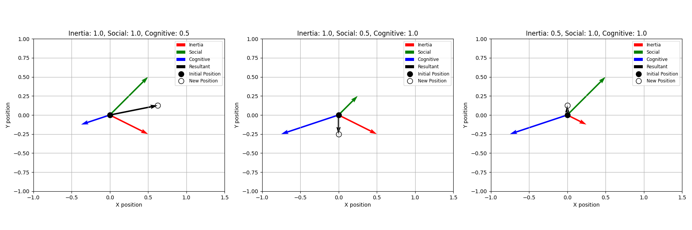
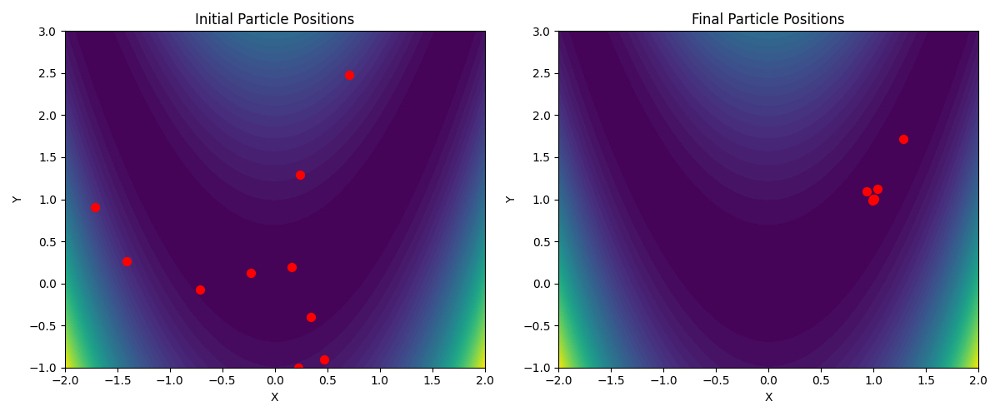

> **Article in progress**

# Particle Swarm Optimization and Its implementation in Python

_An easy entry point to global optimization._

---

I've been working in DevOps for a few years now. But that wasn't always the case. In a “previous life”, I worked in geophysics, more specifically in seismic imaging. 

Despite my new job, geophysics is a subject that has never left me, and to which I return regularly. Whether it's implementing an eikonal solver, a 2D finite-difference wave propagation engine or using local or global optimization.

Recently, I thought it would be nice to document and share some of these topics and make an effort to make them accessible to everyone. 

So I've decided to write small articles that I'll share regularly (as much as possible), starting with a subject that seems relatively simple to me: Particle Swarm Optimization and its implementation in Python.

Heard of particle swarm optimization (PSO) but don't know where to start? In this article, we'll explore how PSO works, in its most basic form, and implement it in Python.

## 1. What is Particle Swarm Optimization?

Particle Swarm Optimization (PSO), proposed by Eberhart and Kennedy in 1995 [1], is a stochastic, population-based, global optimization algorithm designed to simulate the behavior of flocking birds or schools of fish. It means that to find a solution, PSO relies on multiple candidate solutions (population-based) which explore the search space with a certain degree of randomness (stochastic). The specificity of PSO is that it uses social and cognitive components to mimic the behavior of a swarm. This point will be detailed in the next section.

PSO is widely used to solve optimization problems in many scientific and engineering domains [2] including: antenna design, biological, medical and pharmaceutical applications, design and optimisation of communication networks, neural network training, robotics and much more. Its popularity is essentially due to its simplicity to use (few control parameters), its simplicity to implement (simple workflow and equations) and its efficiency to find near-optimal solutions.

Another advantage is that PSO can be easily parallelized, making it a great choice for distributed computing environments. However, we will not focus on this aspect in this article.


## 2. How does PSO work?

As I said before, the principle of PSO is quite simple. It consists in changing the position and velocity of each particle in the swarm to improve the overall best position. In its simple form, PSO consists of the two following equations:

$$x_{i}(t+1) = x_{i}(t) + v_{i}(t+1)\ ,$$
$$v_{i}(t+1) = \omega v_{i}(t) + c_{1} r_{1} (G - x_{i}(t)) + c_{2} r_{2} (P_{i} - x_{i}(t))\ ,$$

where:
- $t$ is the current iteration
- $x_{i}$ is the position of particle $i$
- $v_{i}$ is the velocity of particle $i$
- $G$ is the best global position reached by the swarm
- $P_{i}$ is the best position reached by particle $i$
- $r_{1}$ and $r_{2}$ are random numbers between 0 and 1
- $\omega$ is the inertia weight
- $c_{1}$ and $c_{2}$ are the social and cognitive constants respectively

First, let's decompose the second formula into its three terms to best understand how PSO works. The three terms are:
- **Inertia term**: $\omega v_{i}(t)$ <br>
    which controls how much the particle's velocity is influenced by its own previous velocity
- **Social term**: $c_{1} r_{1} (G - x_{i}(t))$ <br>
    which controls how much the particle is influenced by the swarm's best position
- **Cognitive term**: $c_{2} r_{2} (P_{i} - x_{i}(t))$ <br>
    which controls how much the particle is influenced by its own best position

It means that the displacement of a particle in the search space (first equation) is a combination of its own velocity, the swarm's best position and its own best position. High inertia and high social constant will favorise exploration of the search space, while low inertia and high cognitive constant will favorise exploitation of the best positions found. 

The plot below shows how the particle's velocity is influenced by the three terms and how the values of inertia, social and cognitive constants affect the particle's future position.



The inertia weight is usually set to a value between 0.4 and 0.9 (typical value is around $0.7$) which allows to slow down the particle's velocity throughout the iterations. The cognitive and social constants are usually set between 1.0 and 2.5 (typical values are around $1.49$ with $c_1=c_2$).

The true difficulty of PSO lies in the balance between exploration of the search space and exploitation of the best positions found. This is where the random numbers $r_{1}$ and $r_{2}$ come into play. These two random numbers (drawn from a uniform distribution [0, 1]) allow to ensure some diversity in the behavior of the particles, and to avoid premature convergence to a local minimum (all the particles converge to a local minimum before reaching the global minimum).

To conclude on this section, and before starting implementation, we have to take a look at the basic workflow of PSO. This workflow can be summarized in few steps:
1. Initialize the swarm with random positions and velocities
2. Evaluate the fitness of each particle
3. Update the best position and velocity of each particle
4. Update the swarm best position
5. Repeat steps 2-4 until a stopping criterion is met

The stopping criterion can be a maximum number of iteration, the number of times the swarm best position has not changed, a minimal fitness threshold, etc. or a combination of multiple stopping criteria. To keep it simple, we will use only a maximum number of iterations as a stopping criterion.

## 3. How to implement PSO in Python?

Implementing PSO in Python takes litterally few lines of code. However, I prefer to split in two subsections to give details about each class.

### 3.1 Implementing the Particle class

First, we need to define a class to describe each particle. The particle will have the following attributes:
- its position in an arbitrary n-dimensional space
- its velocity in the same space
- its best position
- its best score

The n-dimensional search space has boundaries which can differ from one dimension to another (you can try to search the optimal solution in an infinite space but it can be very long). To handle this, we'll use a list of tuples which represents the bounds of each dimension of the search space: `bounds: List[Tuple[float, float]]`. Consequently, the current position, the best position and the velocity of each particle will have a size equal to the number of dimensions (`len(bounds)`). 

The score and best score of each particle correspond to the value of the objective function at the current position and the best position respectively. Since the goal will be to find the minimum of the objective function, the scores will be initialized to infinity to ensure that the first evaluation is better that the initial value. If we want to find the maximum of the objective function, we'll need to initialize the score and the best score to negative infinity.

The corresponding code is:
```python
import numpy as np
from typing import Callable, List, Tuple

class Particle:

    def __init__(self, bounds: List[Tuple[float, float]]) -> None:

        # Initialize position of the particle in the search space and velocity to 0
        self.position = np.array([np.random.uniform(low, high) for low, high in bounds])
        self.velocity = np.zeros(len(bounds), dtype=np.float32)
        
        # Initialize score and best score to infinity
        self.score = float('inf')
        self.pbest_score = float('inf')

        # Initialize best position of the particle to its current position
        self.pbest_position = self.position.copy()
```

Now we need to define the methods. The `Particle` class will have the following methods:
- update the velocity
- update the position
- evaluate the score based on the objective function

This part of the code is quite simple, the only thing to take care of is to ensure that the position of the particle is within the bounds of the search space. This is done in the `update_position` method by using the `np.clip` function from the `numpy` library. If the particle is out of bounds, it will be clipped to the closest bound.

The `Callable` type is used to define a function that can be called with any arguments. In our case, it allows to pass the objective function as an argument to the `evaluate` method.
 
```python
import numpy as np
from typing import Callable, List, Tuple

import numpy as np

class Particle:

    def __init__(self, bounds: List[Tuple[float, float]]) -> None:

        # ... the code above
    
    def evaluate(self, objective_function: Callable) -> None:
        self.score = objective_function(self.position)
        if self.score < self.pbest_score:
            self.pbest_score = self.score
            self.pbest_position = self.position.copy()

    def update_velocity(self, gbest_position, inertia, cognitive, social) -> None:
        r1, r2 = np.random.rand(), np.random.rand()
        # Calculate the cognitive and social terms
        cognitive_term = cognitive * r1 * (self.pbest_position - self.position)
        social_term = social * r2 * (gbest_position - self.position)
        # Update the velocity
        self.velocity = inertia * self.velocity + cognitive_term + social_term

    def update_position(self, bounds: List[Tuple[float, float]]) -> None:
        # Update the position
        self.position += self.velocity
        # Ensure the position is within the bounds else set it to the bounds
        self.position = np.clip(self.position, [b[0] for b in bounds], [b[1] for b in bounds])
```

### 3.2 Implementing the Swarm class

Now it is time to define the swarm class. The swarm will have the following attributes:
- a list of particles
- the global best position
- the global best score
- the objective function to optimize
- the bounds of the search space

```python
import numpy as np
from typing import Callable, List, Tuple

class Particle:

    # ... The particle class implementation

class Swarm:

    def __init__(self, num_particles: int, bounds: List[Tuple[float, float]], objective_function: Callable) -> None:
        # Initialize each particle of the swarm
        self.particles = [Particle(bounds) for _ in range(num_particles)]
        # Initialize the global best position and best score
        self.gbest_position = None
        self.gbest_score = float('inf')
        self.objective_function = objective_function
        self.bounds = bounds
```

Contrary to the `Particle` class, the swarm class will have only one method to facilitate comprehension but you are free to split it in multiple small methods. 

This method will optimize the objective function by updating the velocity and position of each particle and updating the global best position and score. 

Before beginning the loop over iterations, the only thing to care of is make sure that each particle's initial position is assessed so that we can determine the swarm's optimal position and score.

The method is implemented as follows:

```python
import numpy as np
from typing import Callable, List, Tuple

class Particle:

    # ... The particle class implementation

class Swarm:

    def __init__(self, num_particles: int, bounds: List[Tuple[float, float]], objective_function: Callable) -> None:

        # ... 

    def optimize(self, num_iterations: int, inertia: float=0.7, cognitive: float=2.1, social: float=2.1) -> Tuple[np.ndarray, float]:

        # Initial evaluation of particles
        for particle in self.particles: 
            particle.evaluate(self.objective_function)
            if particle.score < self.gbest_score:
                self.gbest_score = particle.score
                self.gbest_position = particle.position.copy()
        
        # Start optimization
        for iter in range(num_iterations):

            for particle in self.particles:

                particle.update_velocity(self.gbest_position, inertia, cognitive, social)
                particle.update_position(self.bounds)
                particle.evaluate(self.fitness_function)
                if particle.score < self.gbest_score:
                    self.gbest_score = particle.score
                    self.gbest_position = particle.position.copy()

        return self.gbest_position, self.gbest_score
```

As you can see the global best position is evaluated after each particle's evaluation. This is not always the case in PSO, sometimes the global best position is evaluatued after the whole swarm has been evaluated. However, as far as I know, it is the most common approach.


An that's it! We have implemented the Particle class and the Swarm class. Now we can use them to optimize an objective function.

## 4. Optimizing an objective function

### 4.1 The Rosenbrock function

As an objective function, I chose a common 2D benchmark function.

Benchmark functions are standard mathematical functions used to test and compare optimization algorithms. They allow to evaluate how well an algorithm performs on finding the best solution in a given problem domain. Each is designed  to highlight different optimization difficulties and challenges, such as multiple local minima, flat regions, etc.

Here, we will use the Rosenbrock function. The Rosenbrock function is a non-convex function, introduced by Howard H. Rosenbrock in 1960 and is defined as follows[3,4]:
$$f(x, y) = (a - x)^2 + b(y - x^2)^2\ ,$$
where $x$ and $y$ are the coordinates of a point in a 2D space. Parameters $a$ and $b$ control the shape of the function and are generally fixed at $1$ and $100$, respectively.
The global minimum of the function is located at $(x, y)=(a, a^2)$.


We can implement this function in Python as follows:

```python
# ... PSO implementation ...

def rosenbrock(coordinates):
    # Here the coordinates is the position of the particle
    x, y = coordinates
    return (1 - x)**2 + 100*(y - x**2)**2
```

In our case, the minimum of the Rosenbrock function is located at $(x, y)=(1, 1)$.

### 4.2 Finding the global minimum using PSO

Now that we have defined the Rosenbrock function, let's optimize it using PSO. We keep the same boundarys as before and optimize the Rosenbrock function for 10 particles 200 iterations. We let the default values for inertia weight (0.7), the cognitive (2.1) and the social constant (2.1).

```python
import numpy as np

class Particle:
    # ...
    
class Swarm:
    # ...

def rosenbrock(coordinates):
    # ...

if __name__ == "__main__":
    # Define the bounds of the search space
    bounds = [(-2, 2), (-1, 3)]
    max_iterations = 200
    
    # Initialize the swarm
    swarm = Swarm(num_particles=10, bounds=bounds, optimize_function=rosenbrock)
    
    # Run the optimization
    best_position, best_score = swarm.optimize(num_iterations=max_iterations)
    
    # Print the results
    print(f"Best position: {best_position}")
    print(f"Best score: {best_score}")
```

After running the code, I get the following results:
- Best position: [0.99999276 0.99998353]
- Best score: 4.4429297184307526e-10

As you can see, the best position is close to the global minimum of the Rosenbrock function (1,1) and the best score is close to 0. Of course, since the initialization of the swarm is random, the results may vary.

You can see the initial and final positions of the particles in the following plot:



If fact, have the best position near the global minimum does not mean that all particles are near the global minimum. And it is a good things since it means that some particles continue to explore the search space while others exploit the best positions found.

## 5. What's Next?

Now that you’ve implemented PSO from scratch, try tweaking the parameters! How does changing the inertia weight affect convergence? What happens if you optimize a different function?

I don't already what the next article will be about but certainly about another global optimization algorithm. 

## References

[1] Eberhart, R. H. and Kennedy, J. C. (1995). Particle swarm optimization. IEEE Transactions on Evolutionary Computation, 3(2), 182-197.

[2] Poli, Riccardo (2007). An analysis of publications on particle swarm optimization applications. Essex, UK: Department of Computer Science, University of Essex.

[3] Rosenbrock, H.H. (1960). An automatic method for finding the greatest or least value of a function. The Computer Journal. 3 (3): 175–184.

[4] Wikipedia page on the Rosenbrock function: https://en.wikipedia.org/wiki/Rosenbrock_function

[?] Tharwat, A., Gaber, T., Hassanien, A. E., & Elnaghi, B. E. (2017). Particle swarm optimization: a tutorial. Handbook of research on machine learning innovations and trends, 614-635.