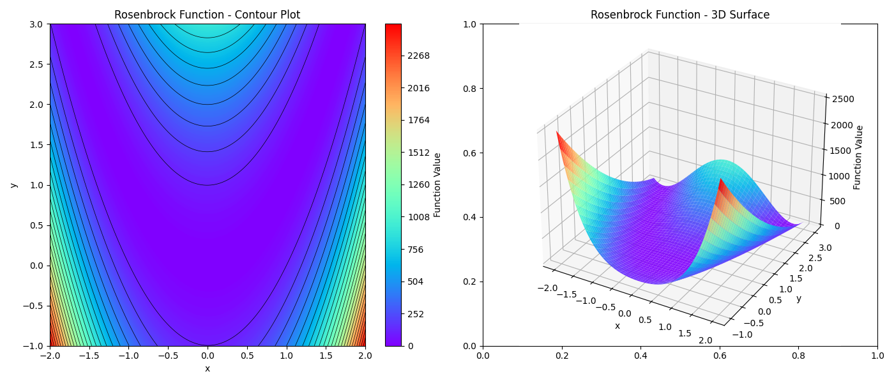

> **Article in progress**

# Particle Swarm Optimization and Its implementation in Python

_An easy entry point to global optimization._

---

I've been working in DevOps for a few years now. But that wasn't always the case. In a “previous life”, I worked in geophysics, more specifically in seismic imaging. 

Despite my new job, geophysics is a subject that has never left me, and to which I return regularly. Whether it's implementing an eikonal solver, a 2D finite-difference wave propagation engine or using local or global optimization.

Recently, I thought it would be nice to document and share some of these topics and make an effort to make them accessible to everyone. 

So I've decided to write small articles that I'll share regularly (as much as possible), starting with a subject that seems relatively simple to me: Particle Swarm Optimization and its implementation in Python.

Heard of particle swarm optimization (PSO) but don't know where to start? In this article, we'll explore how PSO works, in its most basic form, and implement it in Python.

## 1. What is Particle Swarm Optimization?

Particle Swarm Optimization (PSO), proposed by Eberhart and Kennedy in 1995 [1], is a global optimization algorithm designed to simulate the behavior of flocking birds or schools of fish.

PSO is used to solve optimization problems in many scientific and engineering domains, including [2]:
- antenna design
- biological, medical and pharmaceutical applications 
- design and optimisation of communication networks
- neural network training
- robotics  
- and much more.

## 2. Why PSO is useful?
Unlike local optimization techniques (like Gradient Descent), PSO does not require derivatives, making it suitable for messy, real-world functions with multiple peaks and valleys.

PSO is a great entry point into optimization because of its intuitive mechanics and broad applicability. 

It's a simple algorithm that is easy to implement and understand, making it a good choice for beginners and anyone who wants to try out optimization algorithms.

Another advantage is that PSO can be easily parallelized, making it a great choice for distributed computing environments.

Compared to local optimization algorithms, PSO does not rely on the gradient of the objective function, making it a good choice for problems where the gradient is not available.

What sets PSO apart from other global optimization methods (such as Genetic Algorithms or Simulated Annealing) is its swarm-based approach. Instead of relying on operations like mutation or crossover, PSO updates solutions by mimicking how individuals in a group learn from their own experiences and the success of others. This results in fast convergence and robust performance, making it a go-to choice for engineering, machine learning, and more.

| Feature | PSO | Other global optimization (GA, SA) | Local Optimization (Gradient Descent) |
| :---: | :---: | :---: | :---: |
| Derivative-Free?	|  Yes |  Yes |  No |
| Handles Local Minima?	|  Yes	| Yes | No (can get stuck) |
| Speed	| Fast	| Varies |Very fast (for smooth functions) |


## 3. How does PSO work?

The principle of PSO is quite simple and consists in changing the position and velocity of each particle in the swarm to improve the overall best position. In its simple form, PSO consists of the two following equations:

$$x_{i}^{k} = x_{i}^{k-1} + v_{i}^{k}\ ,$$
$$v_{i}^{k} = \omega v_{i}^{k} + c_{1} r_{1} (p_{g}^{k-1} - x_{i}^{k-1}) + c_{2} r_{2} (p_{i}^{k-1} - x_{i}^{k-1})\ ,$$

where:
- $x_{i}^{k}$ is the position of particle $i$ at iteration $k$
- $v_{i}^{k}$ is the velocity of particle $i$ at iteration $k$
- $p_{g}^{k-1}$ is the best global position reached by the swarm
- $p_{i}^{k-1}$ is the best position reached by particle $i$
- $r_{1}$ and $r_{2}$ are random numbers between 0 and 1
- $\omega$ is the inertia weight
- $c_{1}$ and $c_{2}$ are the social and cognitive constants respectively

The velocity formula can be split into three terms:
- **Inertia term**: $\omega v_{i}^{k}$ <br>
    which controls how much the particle's velocity is influenced by its own previous velocity
- **Social term**: $c_{1} r_{1} (p_{g}^{k-1} - x_{i}^{k-1})$ <br>
    which controls how much the particle is influenced by the swarm's best position
- **Cognitive term**: $c_{2} r_{2} (p_{i}^{k-1} - x_{i}^{k-1})$ <br>
    which controls how much the particle is influenced by its own best position

The basic workflow can be described in few steps:
1. Initialize the swarm with random positions and velocities
2. Evaluate the fitness of each particle
3. Update the best position and velocity of each particle
4. Update the swarm best position
5. Repeat steps 2-4 until a stopping criterion is met

## 4. How to implement PSO in Python?

Implementing PSO in Python takes litterally few lines of code. Let's start by defining the needs for the Particle class. To define a particle, we need:
- its position in an arbitrary n-dimensional space
- its velocity in the same space
- its best position
- its best score

To handle arbitrary n-dimensional space, we'll use a list of tuples which represents the bounds of each dimension of the search space: `bounds: List[Tuple[float, float]]`. Consequently, the current position, the best position and the velocity of each particle will be of size `n=len(bounds)`. The score and best score of each particle correspond to the value of the objective function at the current position and the best position respectively. The scores will be initialized to infinity.

```python
import numpy as np

class Particle:

    def __init__(self, bounds: List[Tuple[float, float]]):

        # First we initialize the position of the particle in the search space
        self.position = np.array([np.random.uniform(low, high) for low, high in bounds])

        # Then we initialize the velocity of the particle to 0
        self.velocity = np.zeros(len(bounds))

        # Then the score of the particle is initialized to infinity
        self.score = float('inf')

        # Then we initialize the best position of the particle to its current position
        self.best_position = self.position.copy()

        # Then we initialize the best score of the particle to infinity
        self.best_score = float('inf')
```

Then we need to define a method to update the velocity of each particle and another to update the position in search space. The `update_velocity` method will take as input the global best position, the inertia weight, the cognitive and social constants and the `update_position` method will take as input the bounds of the search space. To avoid particles to be out of bounds of the search space, we'll use the `np.clip` function in the `update_position` method.

Finally, the `evaluate` method will take as input the objective function, calculate the score of the particle and update the best position and score if the score is lower than the current best score.

```python
import numpy as np

class Particle:

    # ... initialization ...

    def update_velocity(self, global_best, w=0.7, c1=1.5, c2=1.5):
        r1, r2 = np.random.rand(), np.random.rand()
        cognitive = c1 * r1 * (self.best_position - self.position)
        social = c2 * r2 * (global_best - self.position)
        self.velocity = w * self.velocity + cognitive + social
    
    def update_position(self, bounds: List[Tuple[float, float]]):
        # np.clip for each dimension
        self.position += self.velocity
        self.position = np.clip(self.position, [b[0] for b in bounds], [b[1] for b in bounds])

    def evaluate(self, objective_function):
        self.score = objective_function(self.position)
        if self.score < self.best_score:
            self.best_score = self.score
            self.best_position = self.position.copy()
```

Now that we have a class to describe each particle, we can define a class to describe the swarm. The swarm will be composed of a list of particles and a global best position. It must also handle the inertia weight, the cognitive and social constants such as the function to optimize.

Let's start by defining the swarm class init method:

```python
class Swarm:

    def __init__(self, num_particles, bounds, max_iter, w, c1, c2, optimize_function):
        # First we initialize the swarm with a list of particles
        self.particles = [Particle(bounds) for _ in range(num_particles)]
        self.bounds = bounds
        # Then we initialize the global best position and best score
        self.global_best_position = min(self.particles, key=lambda p: p.best_score).best_position
        self.global_best_score = min(self.particles, key=lambda p: p.best_score).best_score
        # Then we initialize the function to optimize and the max number of iterations
        self.optimize_function = optimize_function
        self.max_iter = max_iter
        # Finally we initialize the inertia weight, the cognitive and social constants
        self.w = w
        self.c1 = c1
        self.c2 = c2
```

Then we have to define a method to update the swarm throughout the iterations.

```python
class Swarm:

    # ... initialization ...

    def optimize(self):
        for i in range(self.max_iter):
            for particle in self.particles:
                particle.update_velocity(self.global_best, self.w, self.c1, self.c2)
                particle.update_position(self.bounds)
                particle.evaluate(self.optimize_function)
            self.global_best = min(self.particles, key=lambda p: p.best_score).best_position
            self.global_best_score = min(self.particles, key=lambda p: p.best_score).best_score
        return self.global_best, self.global_best_score
```

And...that's it! Congratulations! You have successfully implemented PSO in Python.
So, what's next? Let's optimize a 2D benchmark function.

## 5. Optimizing a 2D benchmark function

Benchmark functions are standard mathematical functions used to test and compare optimization algorithms. They allow to evaluate how well an algorithm performs on finding the best solution in a given problem domain. Each is designed  to highlight different optimization difficulties and challenges, such as multiple local minima, flat regions, etc.

Here, we will use the Rosenbrock function. The Rosenbrock function is a non-convex function, introduced by Howard H. Rosenbrock in 1960 and is defined as follows[3,4]:
$$f(x, y) = (a - x)^2 + b(y - x^2)^2\ ,$$
where $x$ and $y$ are the coordinates of a point in a 2D space. Parameters $a$ and $b$ control the shape of the function and are generally fixed at $1$ and $100$, respectively.
The global minimum of the function is located at $(x, y)=(a, a^2)$.

We can implement this function in Python as follows:

```python
import numpy as np

def rosenbrock(coordinates):
    # Here the coordinates is the position of the particle
    x, y = coordinates
    return (1 - x)**2 + 100*(y - x**2)**2
```



Now that we have defined the Rosenbrock function, let's optimize it using PSO.

```python
import numpy as np
class Particle:
    ...
    
class Swarm:
    ...

def rosenbrock(coordinates):
    ...

if __name__ == "__main__":
    bounds = [(-2, 2), (-1, 3)]
    swarm = Swarm(num_particles=10, bounds=bounds, max_iter=100, w=0.5, c1=0.5, c2=0.5, optimize_function=rosenbrock)
    best_position, best_score = swarm.optimize()
    print(f"Best position: {best_position}")
    print(f"Best score: {best_score}")
```

ADD DISTRIBUTION OF PARTICLES AT START AND END OF OPTIMIZATION

## 6. What's Next?

Now that you’ve implemented PSO from scratch, try tweaking the parameters! How does changing the inertia weight affect convergence? What happens if you optimize a different function?

I don't already what the next article will be about but certainly about another global optimization algorithm. 

## References

[1] Eberhart, R. H. and Kennedy, J. C. (1995). Particle swarm optimization. IEEE Transactions on Evolutionary Computation, 3(2), 182-197.

[2] Poli, Riccardo (2007). An analysis of publications on particle swarm optimization applications. Essex, UK: Department of Computer Science, University of Essex.

[3] Rosenbrock, H.H. (1960). An automatic method for finding the greatest or least value of a function. The Computer Journal. 3 (3): 175–184.

[4] Wikipedia page on the Rosenbrock function: https://en.wikipedia.org/wiki/Rosenbrock_function
